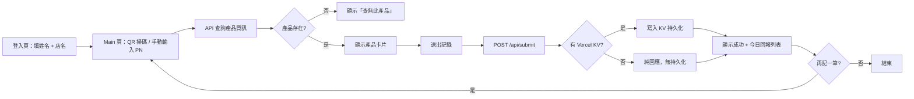

# staff-reporting-system-v2 · PRD v3.0.2 等級規格書

> 自動生成：2026-09-06
> 對齊 SPEC v3.0 契約（SPEC §1–§19 全部套用）
> 原始 v2.2.1 規格見 [PRD/CHANGELOG.md](PRD/CHANGELOG.md) — 本版為實作對齊版

---

## 1. 產品概述

### 1.1 問題陳述
駐點銷售人員（Logi TW 駐點、業務）每日需要記錄拜訪 / 銷售 / 庫存資料。傳統做法是紙本打卡 + 群組回報，主管月底難彙整、缺趨勢分析、缺異常偵測。本工具提供「LINE-style 手機優先 SPA + QR Code 掃碼 + 產品 PN 查詢 + 雲端持久化」，讓駐點人員 30 秒內完成一筆回報、主管即時看當日所有記錄。

### 1.2 目標使用者
| Persona | 工作情境 | 主要任務 |
|---|---|---|
| Primary：駐點銷售人員 | 三井 Outlet / 燦坤門市，行動裝置優先 | 30 秒內完成一筆回報 |
| Primary：駐點督導 | 多門市管理，需即時看每個人當日回報 | 每日檢視、月底彙整 |
| Secondary：行銷主管 | 看趨勢分析、跨門市比較 | 月底報告、產品鋪貨決策 |

### 1.3 核心價值主張
> 「手機優先的駐點回報系統：QR 掃碼 + PN 查詢 + 雲端持久化，30 秒完成一筆。」

### 1.4 Non-Goals（明確不做）
- ❌ 完整 ERP / 進銷存 / 會計（SAP / 鼎新已佔滿）
- ❌ 多語系（繁中為主）
- ❌ 複雜權限系統（v2 不做）
- ❌ 第三方 SSO（LINE / Google 登入留到 v2）
- ❌ AI 自動月報 / 異常偵測（v3 探索）
- ❌ 推播通知（v2 評估）

---

## 2. 使用者場景與流程

### 2.1 使用者流程圖



### 2.2 主要場景
| 場景 | 輸入 | 輸出 | 成功條件 |
|---|---|---|---|
| 駐點人員回報 | 姓名 + 店名 + 掃碼或輸入 PN | 產品資訊 + 寫入記錄 | 30 秒內完成、UI 即時回饋 |
| 督導查當日紀錄 | 姓名 + 日期 | 該人員當日所有回報（時間倒序） | 1 秒內載入、KV 掃描 < 2 秒 |
| 查產品資訊 | PN 碼（PN001 ~ PN015） | 名稱 / 規格 / 類別 / 價格 | 命中回傳 200、查無回 404 |
| QR Code 掃碼 | 相機授權 + 條碼 | 自動填入 PN 欄位 | 10 fps 掃碼、相機權限錯誤友善提示 |

---

## 3. 功能需求

| FR | 名稱 | 優先級 | 狀態 |
|---|---|---|---|
| FR-001 | 登入頁（姓名 + 店名、sessionStorage 暫存） | P0 | ✅ shipped |
| FR-002 | Main 頁（QR 掃碼 + 手動輸入 PN + 今日列表） | P0 | ✅ shipped |
| FR-003 | GET /api/products（15 個示範 PN 查表） | P0 | ✅ shipped |
| FR-004 | POST /api/submit（寫入 Vercel KV） | P0 | ✅ shipped |
| FR-005 | GET /api/records（依姓名 + 日期查當日記錄） | P0 | ✅ shipped |
| FR-006 | GET /api/login（登入驗證 / session） | P1 | ✅ shipped |
| FR-007 | 手機優先 RWD（漸層 + 卡片化設計） | P1 | ✅ shipped |
| FR-008 | 無 KV 時降級（純 API 模式、無持久化） | P1 | ✅ shipped |
| FR-009 | QR Code 掃碼（html5-qrcode + 環境相機） | P1 | ✅ shipped |
| FR-010 | LINE 登入整合 | P2 | ⏳ planned |
| FR-011 | 推播通知（Firebase Cloud Messaging） | P2 | ⏳ planned |
| FR-012 | AI 異常照片偵測 + 月報自動生成 | P3 | ⏳ planned |

---

## 4. Non-Functional Requirements

| 維度 | 需求 |
|---|---|
| Performance | LCP < 2s、QR 掃碼 10 fps、API 回應 < 500ms |
| Security | sessionStorage 暫存、無密碼（demo 階段）、Vercel KV token 由 env 管理 |
| Privacy | 無個資蒐集、無第三方追蹤 |
| Accessibility | WCAG 2.1 AA、按鈕 aria-label |
| Browser | Modern evergreen (Chrome/Edge/Safari/Firefox on mobile) |
| Storage | Vercel KV（可選）— key pattern `report:{id}`、DEMO_PRODUCTS 15 筆寫死 |
| Offline | 部分支援（API 失敗時顯示錯誤、QR 掃碼需網路首次載入） |

---

## 5. 技術架構

```
┌──────────────────────────────────────────┐
│  Next.js 16.2 (App Router) + React 19   │
│  + TypeScript strict + Tailwind CSS 4    │
└────────────────┬─────────────────────────┘
                 │
        ┌────────┴────────┐
        │                 │
   ┌────▼────┐     ┌─────▼──────┐
   │ HTML5   │     │  Session   │
   │ QR Code │     │  Storage   │
   └────┬────┘     └────────────┘
        │
   ┌────▼─────────────┐
   │  API Routes      │
   │  - /api/login    │
   │  - /api/products │
   │  - /api/records  │
   │  - /api/submit   │
   └────────┬─────────┘
            │
   ┌────────▼─────────┐
   │  Vercel KV       │
   │  (可選降級)       │
   │  key: report:id  │
   └──────────────────┘
```

### 5.1 Module Map
- `app/page.tsx` — 登入頁（姓名 + 店名輸入）
- `app/main/page.tsx` + `main-client.tsx` — Main 頁 client component
  - QR 掃碼（html5-qrcode）
  - PN 查詢 + 產品卡片
  - 今日回報列表（時間倒序）
- `app/api/login/route.ts` — 登入驗證
- `app/api/products/route.ts` — PN 查表（15 個示範產品）
- `app/api/records/route.ts` — 當日記錄查詢（KV 掃描 + 過濾）
- `app/api/submit/route.ts` — 寫入新記錄
- `app/layout.tsx` — 根 layout
- `app/globals.css` — Tailwind v4 + 自訂漸層
- `public/` — 5 個 SVG icon
- `PRD/` — 規格書 + CHANGELOG
- `.github/workflows/` — CI/CD

### 5.2 環境變數
- `VERCEL_KV_REST_API_URL`（可選）— Vercel KV REST API URL
- `VERCEL_KV_REST_API_TOKEN`（可選）— Vercel KV REST API token
- 若兩個 env 皆空 → 降級為純 API 模式（無持久化、僅回應）

### 5.3 降級策略
- Vercel KV 不可用 → 純 API 模式（GET /api/records 永遠回空陣列、POST /api/submit 仍回 success）
- 相機權限被拒 → 友善 alert「無法開啟相機，請確認已授權相機權限」
- 產品 PN 查無 → 404 + 「查無此產品」訊息
- 離線模式 → 頁面可開啟但 API 失敗、QR 掃碼停用

---

## 6. Definition of Done

- [x] 功能 P0 / P1 全部實作（FR-001 ~ FR-009）
- [x] `npm run build` 綠
- [x] `npm run lint` 0 error
- [x] GHA CI 跑 4 jobs（lint/test/build/deploy-vercel）全綠
- [x] README 反映現況
- [x] PRD v3.0.2 規格書（本檔）

---

## 7. 部署契約

| 環境 | 目標 | 觸發 |
|---|---|---|
| Production | Vercel | push to main |
| Preview | Per-PR | PR opened |

### 7.1 GHA Workflow
- `.github/workflows/ci.yml`
- jobs: lint / test / build / deploy
- deploy: `vercel`（Next.js 16 App Router）

### 7.2 環境變數
- `VERCEL_KV_REST_API_URL` / `VERCEL_KV_REST_API_TOKEN`（Vercel 後台設定）
- 無 KV 時自動降級為純 API 模式

---

## 8. Out of Scope（不做的）

- 不做帳號系統（demo 階段，sessionStorage 暫存）
- 不做付費牆
- 不做原生 App
- 不做多語系（繁中為主）
- 不做 AI 月報（v3 探索）
- 不做複雜權限（v2 評估）

---

## 9. 變更日誌

見 [`PRD/CHANGELOG.md`](PRD/CHANGELOG.md)
