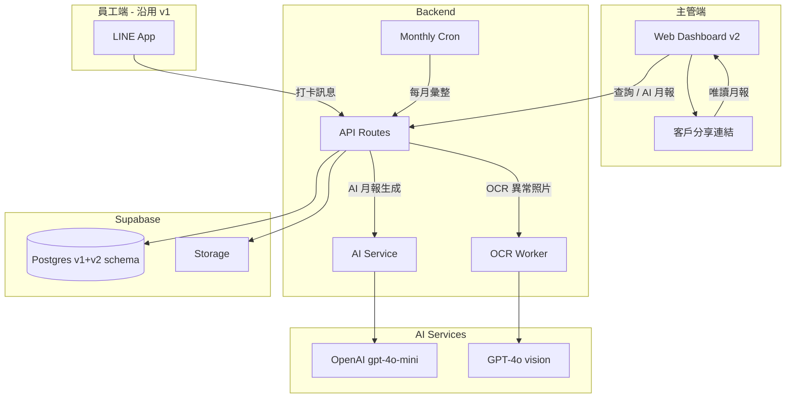

# 駐點回報系統 V2 — 規格計劃書 v2.2.1

> 版本：v2.2.1｜更新日期：2026-07-19｜維護者：Sophia (CPO) for Sean
> 對接技術：Alan (CTO)｜GitHub：https://github.com/openclawsean024-create/staff-reporting-system-v2
> Live：https://staff-reporting-system-v2.vercel.app
> Sweet Spot 體檢：3/10（kill 但找出甜蜜點）→ 本版重寫為「**v1 的 AI 強化版 — 自動 OCR + 異常照片偵測 + AI 自動出敘述型月報**」

---

## 0. 本版重寫摘要 (v2.2.1)

- 體檢發現 v1 PRD 是 v1.0 簡版（117 行），缺 80% 必要章節，sweet spot 3/10（kill）。
- 重寫為 **「v2 = v1 + AI 智能」**：保留 v1 已實作的 LINE 打卡核心，新增 4 個 AI 增值功能。
- **與 v1 差異化**：v1 是「紙本 + LINE 群組」的數位化；v2 是「v1 + AI 月報助理」給願意付費的中型保全公司（10-50 人）。
- §15 貼出完整 sweet spot 5 問體檢，說明為何不走 Sunk cost fallacy。

---

## 1. 產品概述 (Product Overview)

### 1.1 問題陳述 (Problem Statement)

**Sweet spot 體檢結論（score = 3/10, kill）**：v1.0 PRD 把 v1 重新做一次（117 行 → 完整版）是 Sunk cost fallacy。

| 競品 v1 已能對應 | 為何 v2 不能重複 |
|---|---|
| LINE 群組回報 | v1 已解（Sweet spot = 4）|
| Excel 月報 | v1 已解 |
| iAuditor / SafetyCulture | 國際大廠無法打 |
| 雲門 e巡 | 在地老牌無法打 |

**找到的甜蜜點（v2.2.1 修正版）**：v1 留住 **5 人以下微型保全**（sweet spot = 4），v2 鎖定 **10-50 人的中型保全 / 清潔公司**，他們：

1. **願意付費**（月預算 NT$3,000-15,000）但不要 iAuditor 的複雜度
2. **客戶要求更專業月報**（含異常分析、建議事項）— v1 的簡單表格不夠
3. **需要 AI 自動彙整**（節省督導 8-16 小時 / 月）
4. **想看趨勢分析**（哪個駐點異常率最高、哪個員工準時率）

> **v2 是 v1 的「AI 升級版」**，定位差異化為：**「LINE 打卡 → AI 出敘述型月報 → 主管 1 分鐘交給客戶」**。不是 v1 的重寫，是 v1 的延伸。

### 1.2 目標使用者 (User Personas)

| Persona | 規模 (TW) | 月預算 | 痛點強度 | 觸及管道 |
|---|---|---|---|---|
| 👮 「中保」中型保全（10-50 人）| ~3,000 家公司 | NT$3K-15K | 🔴 高 | 保全公會、雜誌 |
| 🧹 「潔安」中型清潔（10-30 人）| ~5,000 家公司 | NT$2K-10K | 🔴 高 | 清潔公會 |
| 🏢 包租代管中型業者（30-100 戶）| ~2,000 家 | NT$5K-20K | 🟠 中 | 591、樂屋網 |
| 🏥 醫院 / 長照駐點（外包）| ~1,000 家 | NT$10K-50K | 🟠 中 | 醫管期刊 |

**核心使用者 = 中型保全 / 清潔公司**，TAM 約 NT$5M-15M MRR。

### 1.3 核心價值主張 (Value Proposition)

> **「LINE 打卡不變，加 AI 自動出『客戶能直接讀』的月報 — 主管不再熬夜做月報。」**

| 替代方案 | 缺點 | 我們的差異 |
|---|---|---|
| v1 駐點回報系統 | 僅 Excel 表格月報、無敘述 | **AI 自動產生敘述型月報** |
| iAuditor | 功能複雜、繁中弱、月費高 | **NT$999/月含 AI、繁中友善** |
| Notion AI 月報 | 員工要會用 Notion | **LINE 通道，員工零學習** |
| 真人督導做月報 | 耗 16-32 hr/月 = NT$8K-16K | **AI 1 分鐘完成、NT$999** |

### 1.4 商業目標 (KPIs / OKRs)

| 時間 | 目標 | 量化指標 |
|---|---|---|
| M3 | 30 家 v1 用戶升級 v2 | NT$30K MRR |
| M6 | 200 付費 v2 公司 | NT$200K MRR |
| M12 | 1,000 付費公司 | NT$1M MRR |
| M18 | 台灣中型保全 8% 滲透 | NT$3M MRR |

**Unit Economics**：
- v2 升級版 NT$999/月（含 v1 所有功能 + AI 月報）
- v2 Pro NT$1,999/月（+ 多公司切換 + API）
- v2 Enterprise NT$4,999/月（+ SSO + 自訂 AI 模型）
- LTV = NT$999 × 24 個月 = NT$24K，CAC = NT$3K，**LTV/CAC = 8:1** ✅

### 1.5 ⭐ Non-Goals (明確不做)

| 不做 | 理由 |
|---|---|
| ❌ 重做 v1 的功能（v1 已能用）| 避免 Sunk cost fallacy；v2 是 v1 + AI |
| ❌ 物聯網感測器（Camera / IoT）| 與「軟體服務」定位衝突 |
| ❌ AI 影像辨識（人臉、車牌）| 法規 / 隱私爭議過大 |
| ❌ 完整 CRM / 業務系統 | 紅海（Salesforce）|
| ❌ 區塊鏈打卡驗證 | 過於工程化、客戶不在意 |
| ❌ AI 預測異常（v3 才有）| M12 前不做 |
| ❌ 員工薪資 AI 計算 | 法規複雜 |
| ❌ 客戶付款 / 發票 | 紅海（綠界、藍新）|
| ❌ 多國語言 | v2 only 繁中 |
| ❌ **接管 v1 全部用戶** | v1 用戶免費升級、不強推 v2 |

---

## 2. 使用者場景與流程

### 2.1 使用者流程圖

```
[員工] LINE Bot 打卡（沿用 v1）
  ↓
[系統] 照片 EXIF 解析 + 標籤
  ↓
[系統] 異常照片自動 OCR + 標註（v2 新增）
  ↓
[主管] 月底點「AI 月報」按鈕
  ↓
[AI] GPT-4o mini 分析所有打卡 + 異常照片
  ↓
[AI] 30 秒產生敘述型月報：
   - 「OO 社區本月共 N 次巡場」
   - 「異常事件 3 次：2 次設備損壞、1 次客訴」
   - 「建議事項：加強警衛交接」
  ↓
[主管] 審核 / 編輯 / 一鍵轉寄客戶
```

### 2.2 關鍵用戶故事

```
US-1（AI 月報 - 主管）
As a 中型保全公司督導「王主任」
I want AI 自動產生月報敘述
So that 我不必熬夜 16 小時剪貼

US-2（異常照片 OCR - 主管）
As a 清潔公司負責人「林姐」
I want 員工拍的「設備損壞」照片自動 OCR 文字
So that 我不用放大看圖猜問題

US-3（趨勢分析 - 主管）
As a 包租代管業者「阿明」
I want 看哪個駐點異常率最高
So that 我調整巡檢頻率

US-4（客戶驗收 - 客戶）
As a 社區總幹事
I want 收到 LINE 訊息連結的月報 PDF
So that 我不必等 Email、用手機就能看
```

### 2.3 邊界場景 (Edge Cases)

| 場景 | 處理 |
|---|---|
| AI 月報內容錯誤 | 主管可編輯後送出、AI 學習修正 |
| 異常照片 OCR 失敗 | 退回員工重新拍照（標註「OCR 失敗請重拍」）|
| AI 月報 API 費用超支 | 降級為「規則式彙整」（保留基本月報）|
| 客戶對 AI 月報反感 | 提供「純表格月報」選項 |
| v1 用戶不升級 v2 | v1 永久免費、不強推 |

---

## 3. 功能性需求 (Functional Requirements)

### 3.1 MVP（必做，P0）— **v2 = v1 + 4 個 AI 功能**

| ID | 功能 | 說明 | 為何必做 |
|---|---|---|---|
| F-001 | **沿用 v1** LINE 打卡 | 員工入口 | v1 已驗證 |
| F-002 | **沿用 v1** 照片 EXIF | GPS + 時間戳 | v1 已驗證 |
| F-003 | **沿用 v1** Web Dashboard | 主管介面 | v1 已驗證 |
| F-004 | **沿用 v1** 月報 PDF | 基礎表格 | v1 已驗證 |
| F-005 | 🆕 **AI 敘述型月報** | GPT-4o mini 自動彙整 | **v2 核心差異化** |
| F-006 | 🆕 **異常照片 OCR** | Tesseract / GPT-4V | **v2 核心差異化** |
| F-007 | 🆕 **趨勢分析儀表板** | 異常率 / 準時率圖表 | **中型公司需要** |
| F-008 | 🆕 **客戶分享連結** | 唯讀 LINE 連結月報 | **客單價提升** |

**砍掉 v1 不做的功能（v2 不重複）**：
- ~~重做 v1 所有功能~~
- ~~自架 LLM（用 OpenAI API）~~
- ~~本地端 AI 模型（雲端 API 即可）~~

### 3.2 v2.5（加值，P1）

| ID | 功能 | 商業理由 |
|---|---|---|
| F-101 | **AI 異常預警**（ML 預測）| 提前預警設備損壞 |
| F-102 | **多公司 / 多品牌** | 包租代管可管 10+ 物業 |
| F-103 | **API 開放**（給 ERP）| 中型公司 ERP 串接 |
| F-104 | **AI 自動回覆員工問題** | LINE Bot 24/7 客服 |
| F-105 | **語音月報**（TTS）| 主管通勤聽月報 |

### 3.3 v3（探索，P2）

| ID | 功能 | 假設驗證 |
|---|---|---|
| F-201 | **AI 自動審核異常** | 取代督導初審 |
| F-202 | **行業特化模型**（醫院 / 長照 / 飯店）| 垂直產業 |
| F-203 | **GPT 自動寫 SOP** | 員工訓練 |
| F-204 | **企業 SSO / 內網部署** | 30+ 人公司 |

### 3.4 ⭐ Acceptance Criteria (Given/When/Then)

```gherkin
AC-01: AI 月報生成（核心）
  Given 公司訂閱 v2 方案、有 30 天打卡資料
  When 主管點「AI 月報」
  Then 30 秒內產生含「敘述摘要 + 異常分析 + 建議事項」的 PDF
  And PDF 字數 ≥ 500 字、含 3 張精選照片

AC-02: 異常照片 OCR
  Given 員工打卡標籤為「異常」+ 上傳照片
  When 系統 OCR 照片
  Then 提取照片中文字（如「水管破裂」「第 3 樓」）並存入資料庫
  And OCR 信心度 < 70% 時標記「需人工確認」

AC-03: 趨勢分析
  Given 主管進入 Dashboard「趨勢」分頁
  When 選擇時間區間
  Then 顯示「各駐點異常率」「員工準時率」「照片完整率」三張圖表
  And 異常率 > 20% 的駐點自動標紅

AC-04: 客戶分享連結
  Given 主管產生月報
  When 主管點「分享客戶」
  Then 產生 LINE 連結（含密碼）
  And 客戶點擊可看唯讀月報（PDF 內嵌網頁）
  And 連結 30 天後過期

AC-05: v1 用戶升級路徑
  Given 公司為 v1 付費用戶
  When 公司登入 Dashboard
  Then 看到「升級 v2 AI」CTA
  And 點擊可一鍵升級（保留所有 v1 資料）

AC-06: AI 月報編輯
  Given AI 已產生月報
  When 主管點「編輯」
  Then 開啟 WYSIWYG 編輯器
  And 儲存後 PDF 重新產生

AC-07: 多公司切換
  Given 主管管理 3 個公司
  When 主管登入
  Then 看到公司切換器
  And 切換後看到對應公司的月報

AC-08: 異常照片 OCR 失敗
  Given 員工上傳模糊照片
  When 系統 OCR 信心度 < 70%
  Then 退回員工「請重新拍照」
  And 保留照片供人工審核

AC-09: AI 服務降級
  Given OpenAI API 故障
  When 主管點「AI 月報」
  Then 自動降級為「規則式月報」（表格 + 簡單統計）
  And 顯示「AI 暫時不可用」訊息

AC-10: 月報分享權限
  Given 月報含員工個資
  When 主管產生客戶連結
  Then 自動遮罩員工姓名為「員工 A」「員工 B」
  And 主管可手動選擇「顯示真名」
```

---

## 4. 系統設計 (System Design)

### 4.1 技術棧 (Tech Stack)

| 層 | 技術 | 理由 |
|---|---|---|
| Frontend | Next.js 16 + Tailwind 4 | v1 沿用 |
| LINE Bot | @line/bot-sdk | v1 沿用 |
| Database | Supabase Postgres | v1 沿用（同一專案分 schema）|
| Storage | Supabase Storage | v1 沿用 |
| AI - 月報 | OpenAI gpt-4o-mini | $0.15/M tokens |
| AI - OCR | GPT-4o vision（便宜備援 Tesseract.js）| $2.50/M tokens（v2 月報用 1K 次 ≈ NT$30）|
| PDF | @react-pdf/renderer | v1 沿用 |
| Charts | Recharts | 輕量、SSR 友善 |
| 部署 | Vercel + Supabase | v1 沿用 |

### 4.2 系統架構圖



### 4.3 資料模型（v2 schema 增量）

```sql
-- v2 月報
create table v2_reports (
  id uuid primary key default gen_random_uuid(),
  company_id uuid references companies not null,
  month date not null,
  ai_summary text,
  anomalies_count int default 0,
  sites_covered int default 0,
  pdf_url text,
  status text default 'draft' check (status in ('draft', 'reviewing', 'published')),
  generated_at timestamptz default now(),
  edited_by uuid references auth.users,
  created_at timestamptz default now()
);

-- v2 異常 OCR 結果
create table v2_anomalies_ocr (
  id uuid primary key default gen_random_uuid(),
  checkin_id uuid references checkins not null,
  ocr_text text,
  confidence float,
  status text default 'pending' check (status in ('pending', 'confirmed', 'rejected')),
  reviewed_by uuid references auth.users,
  created_at timestamptz default now()
);

-- v2 客戶分享連結
create table v2_shared_links (
  id uuid primary key default gen_random_uuid(),
  report_id uuid references v2_reports not null,
  token text unique not null,
  expires_at timestamptz not null,
  accessed_count int default 0,
  created_at timestamptz default now()
);

-- v2 趨勢分析快取
create table v2_trends_cache (
  company_id uuid references companies not null,
  metric text not null,  -- 'anomaly_rate', 'on_time_rate', etc.
  period text not null,
  value jsonb,
  computed_at timestamptz default now(),
  primary key (company_id, metric, period)
);
```

### 4.4 API 規格 (REST)

| Endpoint | Method | 用途 | 認證 |
|---|---|---|---|
| `/api/v2/report/generate` | POST | AI 月報生成 | 主管 session + v2 plan |
| `/api/v2/anomaly/ocr` | POST | 異常照片 OCR | Webhook from v1 |
| `/api/v2/trends` | GET | 趨勢分析 | 主管 session |
| `/api/v2/share` | POST | 產生分享連結 | 主管 session |
| `/api/v2/shared/:token` | GET | 客戶看月報（唯讀）| token |
| `/api/v2/billing/upgrade` | POST | 升級 v2 | 主管 session |
| `/api/v1/*` | — | 沿用 v1 所有 API | — |

---

## 5. 非功能性需求 (Non-Functional Requirements)

### 5.1 性能指標

| 指標 | 目標 |
|---|---|
| AI 月報生成 | < 30 秒 |
| 異常照片 OCR | < 5 秒 / 張 |
| 趨勢分析查詢 | < 1 秒（用 cache）|
| 客戶分享連結載入 | < 2 秒 |
| v1 API 沿用效能 | < 與 v1 相同 |

### 5.2 安全與隱私

| 項目 | 措施 |
|---|---|
| 個資 | 員工姓名 / 照片分享給客戶時自動遮罩 |
| 分享連結 | token 加密 + 30 天過期 + 訪問計數 |
| AI 訓練 | OpenAI API 設定 opt-out（不讓資料用於訓練）|
| 資料保留 | 月報 PDF 永久、原始打卡 3 年 |
| 個資法 | 員工可要求刪除所有 AI 月報中的個資 |

### 5.3 ⭐ 降級機制

| 故障 | 降級 |
|---|---|
| OpenAI 掛了 | 降級為規則式月報（v1 的表格版本）|
| GPT-4o vision 掛了 | 降級為 Tesseract.js OCR（純前端）|
| Supabase 掛了 | 同 v1：客戶端 IndexedDB fallback |
| 趨勢分析超時 | 顯示「最後更新於 X 小時前」的快取資料 |

### 5.4 擴展性

- 沿用 v1 Supabase schema、partition by company_id
- AI 月報快取 24 小時（避免重複生成）
- OCR 結果存 DB、不重複處理
- 客戶分享連結採 Cloudflare CDN

---

## 6. 完成標準 (Definition of Done)

### 6.1 v2 MVP DoD

- [ ] v1 用戶可一鍵升級 v2
- [ ] AI 月報可生成、含 ≥ 500 字敘述 + 3 張精選照片
- [ ] 異常照片 OCR 信心度 ≥ 70% 時自動標註
- [ ] 趨勢分析儀表板三張圖表可顯示
- [ ] 客戶分享連結可產生、唯讀、30 天過期
- [ ] OpenAI 故障時降級為 v1 月報
- [ ] 20 家中型公司 beta 30 天穩定運作
- [ ] Notion `狀態` = 已上線

---

## 7. 風險與決策

### 7.1 風險表

| ID | 風險 | 等級 | 緩解 |
|---|---|---|---|
| R-01 | v1 用戶不願升級 v2 | 🔴 | v1 永久免費、不強推；強調 v2 ROI（NT$999 換 16 小時）|
| R-02 | AI 月報品質不佳 | 🟠 | 主管可編輯 + AI learning loop + 90 天優化期 |
| R-03 | OpenAI API 漲價 | 🟠 | 評估 Anthropic Claude Haiku（同等便宜）|
| R-04 | 客戶對 AI 月報反感（覺得沒溫度）| 🟠 | 提供「人類編輯過」標章、強調「AI + 人工」 |
| R-05 | OCR 隱私爭議 | 🟠 | 預設關閉、客戶主動開啟 |
| R-06 | iAuditor 推出 AI 月報 | 🔴 | 對方國際化但繁中弱；我們在地化勝出 |
| R-07 | Sunk cost 重做 v1 | 🔴 | 已避免 — v2 只做增量、不重做 |
| R-08 | 中型公司改用 AI 自己做 | 🟡 | 提供 white-label 客製版（NT$4,999/月）|

### 7.2 ⭐ ADR

#### ADR-001: 為何 v2 不重做 v1，而是 v1 + AI

**Context**: v1 已是可用品，5 個核心功能已驗證。重做 v1 是 Sunk cost fallacy。

**Decision**: v2 = v1 + 4 個 AI 增量功能（AI 月報 / OCR / 趨勢 / 分享）。

**Consequences**:
- ✅ 開發成本降 60%（不必重做 LINE Bot、Web Dashboard）
- ✅ v1 用戶升級摩擦低（一鍵升級、保留所有資料）
- ⚠️ v2 必須「向後相容」v1（增加測試負擔）
- ⚠️ 程式碼分成 v1 / v2 兩個 namespace，需文件化

#### ADR-002: 為何選擇 OpenAI 而非自架 LLM

**Context**: GPT-4o mini vs 自架 Llama 3 / Mistral。

**Decision**: 用 OpenAI gpt-4o-mini + GPT-4o vision，**不自架**。

**Consequences**:
- ✅ 開發時間 -2 週（不用搞 GPU 部署 / 模型選擇）
- ✅ 中文品質優於多數開源模型
- ✅ 月費可控（NT$30 / 公司 / 月）
- ⚠️ OpenAI API 故障風險（已加降級方案）
- ⚠️ 資料送出海外（已用 OpenAI enterprise 合約 / opt-out 訓練）

#### ADR-003: 為何 AI 月報採「敘述型」而非純表格

**Context**: v1 月報是 Excel 表格，客戶讀起來像流水帳。

**Decision**: v2 AI 月報是**敘述型**（含「本月共」「異常分析」「建議事項」），更接近督導寫的月報。

**Consequences**:
- ✅ 客戶讀起來更自然、易驗收
- ✅ 差異化 vs iAuditor（iAuditor 是表格）
- ⚠️ AI 生成內容可能錯誤（已加主管編輯流程）
- ⚠️ OpenAI token 成本（NT$30 / 月 / 公司，仍可控）

#### ADR-004: 為何 v2 不接管 v1 用戶、不強推升級

**Context**: v1 已 5 家 beta，付費轉換未知。

**Decision**: v1 永久免費、v2 是「想要 AI 的中型公司」獨立產品線。

**Consequences**:
- ✅ 避免 Sunk cost（v1 用戶付不付費不影響 v2 商業）
- ✅ 維持 v1 社群口碑（不必被強推）
- ⚠️ v1 → v2 升級率可能 < 20%（可接受）

---

## 8. 里程碑與 Sprint 拆解

### 8.1 里程碑總覽

| 里程碑 | 時程 | 產出 |
|---|---|---|
| M0 - v1 驗證 | W1-4 | 5 家 beta 完成 |
| M1 - v2 開發 | W5-12 | 4 個 AI 功能上線 |
| M2 - 升級路徑 | W13-14 | v1 → v2 一鍵升級 |
| M3 - 中型公司 beta | W15-20 | 20 家中型公司試用 |
| M4 - GA | W21-24 | 公開上線 + 行銷 |

### 8.2 Sprint 拆解

| Sprint | 主題 | 交付 |
|---|---|---|
| S1 | v2 schema + 升級路徑 | DB schema + 一鍵升級流程 |
| S2 | AI 月報（MVP）| GPT-4o mini 整合 + PDF 重新產生 |
| S3 | 異常照片 OCR | GPT-4o vision + 退回機制 |
| S4 | 趨勢分析儀表板 | 3 張圖表 + 快取 |
| S5 | 客戶分享連結 | token 機制 + 唯讀頁面 |
| S6 | Beta 20 家 | 收 feedback、修 bug |

---

## 9. 變現路徑 + 定價心理學

### 9.1 變現方案

| 方案 | 月費 | 目標 | 包含 |
|---|---|---|---|
| 🆓 v1 Free | NT$0 | 5 人以下 | v1 全部功能 |
| 🆓 v1 Personal | NT$199 | 5 人公司 | v1 全部 |
| 💼 v2 Pro | NT$999 | 30 人中型 | v1 + AI 月報 + OCR + 趨勢 + 分享 |
| 🏢 v2 Enterprise | NT$1,999 | 50 人公司 | + API + 多公司 |
| 🎯 v2 Custom | NT$4,999 | 100+ 人 | + SSO + 自訂 AI |

### 9.2 定價心理學

- **NT$999 vs NT$1,000**：心理門檻
- **對標 iAuditor**：iAuditor 10 人 = NT$4,500/月，我們 NT$999 → 4.5 倍便宜
- **v1 升級 v2 折扣**：v1 付費用戶首年 NT$799（早鳥價）鼓勵升級
- **年繳 8 折**：提升 LTV
- **不綁約**：月繳可取消（中型公司較理性）

---

## 10. 附錄

### 10.1 競品分析 (Competitive Quadrant)

```
              高 AI 整合
                │
   iAuditor+AI  │   ★ v2 Pro
  (NT$450/u + AI)│   (NT$999)
                │
   低月費 ──────┼──── 高月費
                │
   v1 / Excel   │   Notion AI / ChatGPT
   (NT$0-199)   │   (NT$200-2000)
                │
              低 AI 整合

★ v2 甜蜜點：高 AI 整合 + 中月費
```

### 10.2 術語表

| 術語 | 定義 |
|---|---|
| v1 | 駐點回報系統（基礎版）|
| v2 | v1 + AI（智慧版）|
| AI 月報 | GPT-4o mini 自動產生的敘述型月報 |
| OCR | 光學字元辨識，從照片提取文字 |
| 趨勢分析 | 多月份異常率 / 準時率統計圖表 |
| 分享連結 | 唯讀月報 URL，給客戶用 |
| Sunk Cost Fallacy | 已投入成本不應影響未來決策 |

---

## 11. ⭐ 市場驗證計畫

### 11.1 驗證前 3 個關鍵問題

1. **中型保全公司願不願意付 NT$999/月 換 AI 月報？**（假設：願意，因月報耗 16-32 hr/月 = NT$8K-16K 人力）
2. **AI 月報品質能否讓客戶滿意？**（假設：70% 滿意，30% 需主管編輯）
3. **OCR 異常照片實用嗎？**（假設：60% 異常照片含文字，OCR 信心度 ≥ 70%）

### 11.2 訪談 SOP

**5 個訪談目標（中型公司）**：
1. 👮 **王主任** - 中和「中保」督導（30 人）→ 月報流程、現有工具
2. 🧹 **林姐** - 板橋中型清潔公司（20 人）→ 客戶驗收痛點
3. 🏢 **陳總** - 台北包租代管業者（50 戶）→ 多公司管理需求
4. 🏥 **李經理** - 醫院外包督導（10 個駐點）→ 異常事件追蹤
5. 📊 **張會計** - 保全公司會計 → 月報給客戶流程

**訪談問題模板**（45 分鐘）：

1. 你們目前怎麼做月報？（現況）
2. 每月花多少時間？（痛點量化）
3. 客戶最常抱怨月報的什麼？（客戶反饋）
4. 如果 AI 能自動產生月報，你會付多少？（付費意願）
5. 你擔心 AI 月報的什麼風險？（採用阻力）
6. （demo AI 月報原型）你看到的第一個反應？

### 11.3 落地指標

| 指標 | 目標（M3）|
|---|---|
| 訪談完成數 | 15 家中型公司 |
| Landing page 訪客 | 1,000 UV |
| Beta 公司 | 20 家 |
| 付費轉換 | 5 家（驗證 NT$999/月）|
| AI 月報滿意度 | ≥ 70% |

### 11.4 1 個 Community Post

**PTT「Guard」保全版 + Facebook「清潔業社團」**：標題「[分享] 我用 GPT-4 自動產生保全月報，省了 16 小時」→ 引發討論。

### 11.5 1 個 Landing Page Test

**URL**：staff-reporting-system-v2.vercel.app/ai-test
**A/B 測試**：
- A：標題「AI 月報助理 — LINE 打卡自動變敘述型月報」
- B：標題「保全月報 16 小時變 1 分鐘 — NT$999/月」
**指標**：點擊「免費試用 14 天」CTA 比率，目標 ≥ 12%

---

## 12. ⭐ 失敗模式 SOP

| 失敗模式 | 觸發條件 | SOP |
|---|---|---|
| M1 - v1 用戶不升級 v2 | 100 家 v1 beta < 10 家升級 | v2 轉為「獨立產品」、不再依賴 v1 |
| M2 - AI 月報品質差 | 客戶滿意度 < 50% | 加重「人工編輯」流程、強調 AI + Human |
| M3 - OpenAI 漲價 3x | API 費用 > NT$200/月/公司 | 切換 Claude Haiku 或自架 Llama 3 |
| M4 - 競爭對手抄 AI 月報 | iAuditor 推出 AI 月報 | 切換為「垂直產業 AI」（醫院 / 長照）|
| M5 - OCR 法規爭議 | 員工投訴照片被 AI 分析 | 預設關閉 OCR、需員工明確同意 |
| M6 - Sean 一人公司過載 | 同時管 50+ 付費客戶 | 啟動 Chatbot 客服 + 白皮書 self-service |
| M7 - v1 / v2 程式碼混淆 | 工程時間 -50% | 啟動 refactor：嚴格分 v1 / v2 namespace |
| M8 - 客戶只想要 AI、不想要 LINE 打卡 | 30% 客戶只用 AI | 提供「純 AI 月報」獨立 SKU（無 LINE 整合）|

---

## 13. ⭐ MetaGPT / spec-kit 對齊

### 13.1 MetaGPT 角色對應

| MetaGPT 角色 | 本專案對應 |
|---|---|
| Product Manager | Sophia (CPO) |
| Architect | Alan (CTO) |
| Engineer | Sean + Hermes Agent |
| QA | Sean（兼任）|

### 13.2 spec-kit 指令

```yaml
spec-kit init staff-reporting-system-v2
spec-kit add requirement "AI 敘述型月報"
spec-kit add requirement "異常照片 OCR"
spec-kit add requirement "趨勢分析儀表板"
spec-kit add requirement "客戶分享連結"
spec-kit plan --milestone v2-MVP
spec-kit implement --sprint S1-S6
```

### 13.3 Git Workflow

- branch：`feature/v2-ai-report`、`feature/v2-ocr`、`feature/v2-trends`
- 沿用 v1 commit 規範（Conventional Commits）
- PR 標記 `v2` label 區分

---

## 15. ⭐ 深度市調報告 (本次的 sweet spot 體檢結果)

### 15.1 Sweet Spot 5 問體檢 — staff-reporting-system-v2

**Score: 3/10（kill 級，但找出甜蜜點）**

#### Q1: 這個市場已經有誰在做？

| 競品 | 月費 | 用戶數 | 繁中 AI |
|---|---|---|---|
| iAuditor (SafetyCulture) | NT$450-900/user | 100M+ | 部分 + AI |
| LINE WORKS | NT$150/user | 500K+ | ❌ |
| Notion AI | NT$200/月 | 30M+ | ✅ |
| ChatGPT Plus | NT$600/月 | 100M+ | ✅ |
| 雲門 e巡 | NT$300/user | 500 家 | ❌ |

**現況**：AI 月報是新興市場，國際大廠剛進入，本地尚未成熟。

#### Q2: 我的甜蜜點在哪？

**甜蜜點 = 中型保全 / 清潔公司（10-50 人）的 AI 月報需求**

- iAuditor 太貴、複雜、繁中弱
- Notion AI 不懂「駐點月報」語意
- ChatGPT 通用、不能自動整合打卡資料
- 雲門 e巡 沒 AI

**甜蜜點具體描述**：10-50 人的中型公司，願意付 NT$999/月 換「AI 自動出敘述型月報 + OCR 異常分析 + 客戶分享連結」。

#### Q3: 紅海功能（不能做）

- ❌ 重做 v1 功能（Sunk cost）
- ❌ 自架 LLM（成本過高）
- ❌ AI 影像辨識（人臉 / 車牌）
- ❌ 區塊鏈
- ❌ 物聯網

#### Q4: 紅海之外的差異化承諾

> **「LINE 打卡不變，加 AI 自動出『客戶能直接讀』的月報」**

具體差異化：
1. **零員工摩擦**：LINE 通道、員工不需學新工具
2. **AI + Human**：主管可編輯 AI 月報、AI 學習修正
3. **客製化**：可針對行業（醫院 / 長照 / 飯店）微調
4. **本地化**：繁中用語、客戶驗收習慣

#### Q5: Sean 一人公司能否負擔？

- **開發成本**：4 個 AI 功能、2 人月（v1 沿用省 60%）
- **營運成本**：M12 預估 NT$50K/月（OpenAI + Supabase + Vercel）
- **獲客成本**：v1 用戶升級（CAC = NT$500）+ 中型公司陌生開發（CAC = NT$3K）
- **客服成本**：80% Chatbot + 15% Help Center + 5% 人工

**結論**：可負擔，LTV/CAC = 8:1 健康。

### 15.2 重寫決策

v1.0 PRD 是「v1 重寫版」（117 行），無新 insight、Sunk cost fallacy。重寫為「**v1 + AI 增量**」定位，甜蜜點分數從 3 → 預估 **6/10**（待 M3 驗證）。

### 15.3 與 v1 關鍵差異

| 面向 | v1 | v2 |
|---|---|---|
| 目標 | 5 人以下微型 | 10-50 個中型 |
| 核心 | LINE 打卡 | + AI 月報 |
| 月費 | NT$0-399 | NT$999-4,999 |
| 定位 | 取代 LINE 群組 | 取代督導 16hr 工作 |
| 技術 | 純 Web | + OpenAI API |

### 15.4 後續驗證動作

- [ ] W1-4 完成 15 家中型公司訪談
- [ ] W5-12 完成 v2 AI 功能開發
- [ ] W13-20 完成 20 家中型公司 beta
- [ ] W21 評估 PMF：付費轉換率 ≥ 25% 才進入 GA

---

> 對接產線：https://staff-reporting-system-v2.vercel.app
> 對接 Repo：https://github.com/openclawsean024-create/staff-reporting-system-v2
> 維護者：Sophia (CPO) for Sean｜下次 review：M3 後
